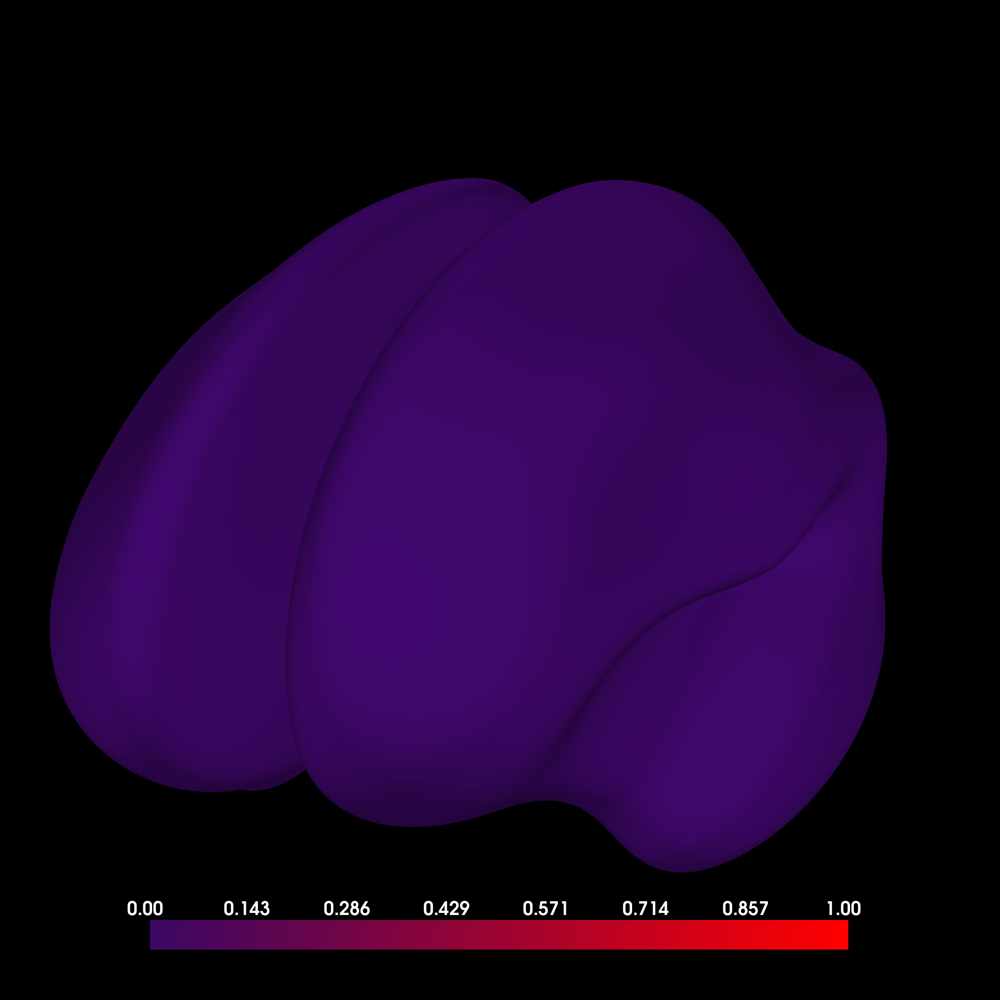
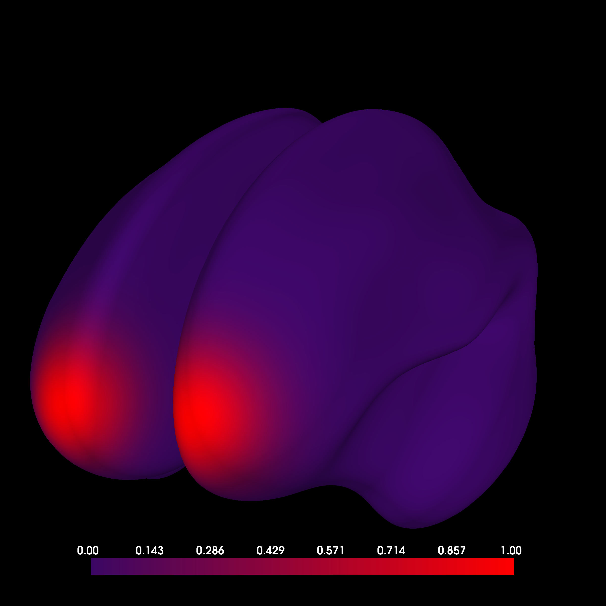
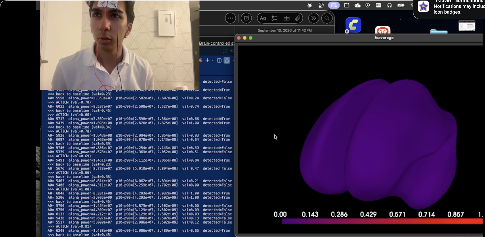
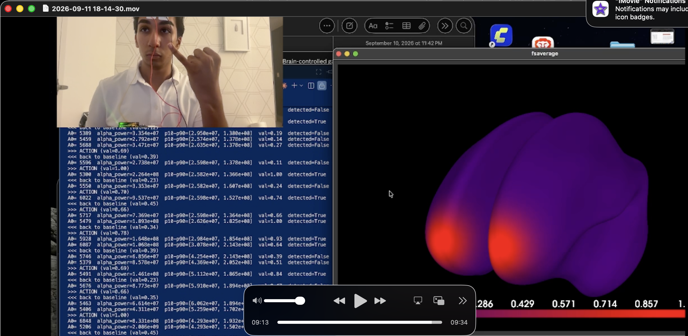

# BCI Brain-Signal Controller

EEG rig that reads a real brainwave signal from three electrodes, detects actions, and fires a live, visible trigger — built for
VoltHacks 2026.




*Left: baseline (no trigger). Right: the moment alpha power crosses the
threshold — the same real signal, rendered on an animated 3D brain model.*

## What it does

One gel electrode on the forehead feeds a BioAmp EXG Pill amplifier, which
feeds an Arduino Uno R4 Minima, which streams raw signal over serial to a
Python pipeline. That pipeline computes rolling alpha-band (8–13Hz) power in
real time, and when it crosses a threshold — which happens reliably when you
close your eyes and relax — it fires a discrete event: a console message and
a live color change (calm purple → lit-up red) on a 3D brain visualization.

The 3D brain model is an illustrative indicator of signal strength
at roughly the electrode's location — not real anatomical source
localization.

Hardware, running live - (hopefully youtube video out soon)




*Live capture: webcam feed of the actual electrode on the forehead (top
left), the real-time detection log (bottom left — `alpha_power`, the
rolling `p10-p90` normalization range, and `val`), and the 3D brain model
reacting live (right). Top: baseline. Bottom: `>>> ACTION` firing.*

## Repo structure

```
firmware/
  arduino_r6_neuralink/     the actual sketch flashed to the Arduino
  BioAmp-EXG-Pill-main/     Upside Down Labs' reference hardware/firmware repo
software/
  chords_protocol.py        shared serial protocol parsing (packet framing, band power)
  debug_signal.py           lightweight signal-quality check: terminal + live plot, no 3D
  brain_model_live_chords.py  the live demo: real signal -> threshold -> 3D brain trigger
  brain_model.py             offline animated demo (no hardware needed)
images/                     README screenshots
archive/                    earlier draft scripts, kept for history (superseded — don't use)
```

## Hardware

- Upside Down Labs BioAmp EXG Pill
- Arduino Uno R4 Minima
- Gel electrodes: signal on the forehead, reference behind the ear, ground on
  another forehead point (the standard Upside Down Labs 3-lead montage)

## How to use it

**1. Flash the firmware**
Open `firmware/arduino_r6_neuralink/arduino_r6_neuralink.ino` in the Arduino
IDE, select board **Arduino UNO R4 Minima**, and upload. This is the
"Chords" binary protocol firmware — 6-channel packets at 230400 baud, 14-bit
ADC, `WHORU`/`START`/`STOP` handshake commands.

**2. Wire it up**
BioAmp Pill's `OUT` → Arduino `A0`, `GND` → `GND`, `3.3V`/`VCC` → power.
Electrodes: signal on the forehead, reference behind the ear, ground on
another forehead spot.

**3. Install Python dependencies**
```
pip install pyserial numpy matplotlib mne pyvistaqt
```

**4. Check your serial port**
```
ls /dev/tty.usbmodem*
```
macOS reassigns this number when the Arduino gets unplugged/replugged, so it
drifts between sessions. Update `SERIAL_PORT` in `software/chords_protocol.py`
to match whatever this command actually prints.

**5. Sanity-check the signal first**
```
cd software
python3 debug_signal.py
```
Confirms real data is coming in — watch the printed values and the live
waveform plot move. Do this before touching the 3D visualization, since it
starts instantly (no `mne` load) and isolates hardware issues from
visualization issues.

**6. Run the live demo**
```
python3 brain_model_live_chords.py
```
Loads the 3D brain model (can take a while on first run — downloads the
`fsaverage` template), then starts streaming. Sit still, relax, then close
your eyes — watch the terminal print `>>> ACTION` and the brain flip from
purple to red. Press `P` in the brain window to pause/resume; `Ctrl+C` in
the terminal to quit.

**7. (No hardware handy?)**
```
python3 brain_model.py
```
Runs the same 3D visualization with a scripted animated signal instead of
live hardware — good for demoing the visualization alone.

## What's next

The next real milestone is turning the detected event into an actual game
input for **Tom Clancy's Rainbow Six Siege on PS5**. Siege added native
mouse-and-keyboard support on console in 2026, and the Arduino Uno R4 Minima
can act as a real USB HID keyboard/mouse — so the plan is to have the
detected event fire an actual click, plugged straight into the PS5, no
controller-authentication workaround needed. Beyond that: multi-channel EEG
for richer control, pairing with webcam-based gaze tracking, and a more
robust artifact-rejection stage so the trigger holds up outside a
controlled, sit-still test.

## Credits

Firmware based on Upside Down Labs' open-source BioAmp EXG Pill hardware and
Chords protocol (`firmware/BioAmp-EXG-Pill-main/`, GPLv3).

## License

MIT for the original contents of this repo (`software/`, docs) — see
[LICENSE](LICENSE). The bundled Upside Down Labs firmware in `firmware/`
remains GPLv3, under its own license.
